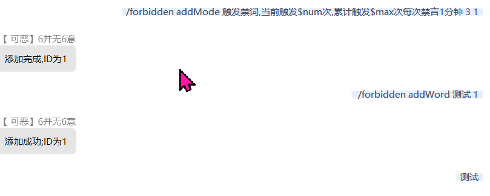
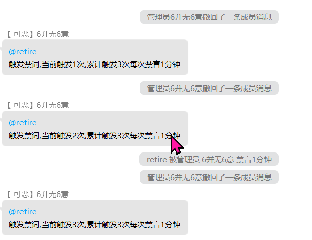

### 禁词管理

### 同时需要[依赖](https://github.com/Kloping/Mirai_Plugins_Auto_Reply/releases/tag/lib-tts.0)

- [KlopLocalityDataBase](https://github.com/gdpl2112/KlopLocalityDataBase)

命令列表

    /forbidden addMode <触发提示文本> <警告次数为0时则直接禁言> <禁言时长/分钟> <是否撤回true/false>   # 添加一个模式
    /forbidden addWord <禁词文本> <关联 mode Id>    # 添加一个禁词
    /forbidden deleteMode <id>    # 删除指定ID模式
    /forbidden deleteWord <id>    # 删除指定ID模式
    /forbidden listMode    # 列出所有模式
    /forbidden listWord    # 列出所有禁词

